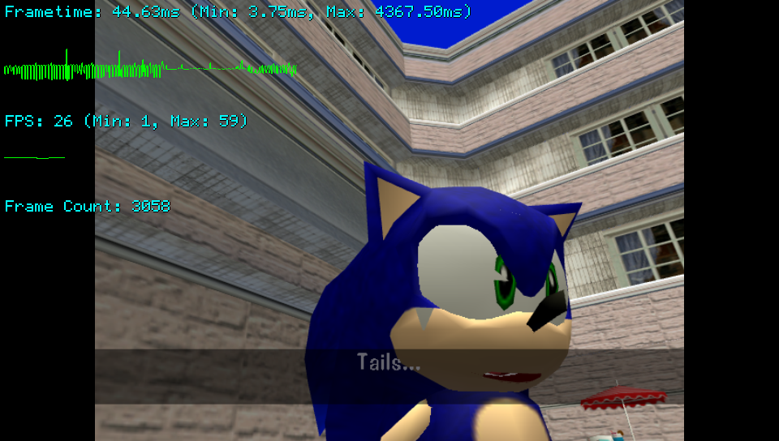

# ViBeS

ViBeS (short for Vita Benchmarking Software) is a plugin for benchmarking games and homebrews.

The plugin allows to analyze in realtime frametime and framerate, collecting also minimum and maximum values of these two, and shows details about these in comfortable to inspect charts, similarly to how RTSS (RivaTuner Statistics Server) works for PC benchmarking.

## Changelog

### v.1.0

- Initial release.

## Setup Instructions

- In order to properly use this plugin with commercial games, [ioplus](https://github.com/CelesteBlue-dev/PSVita-RE-tools/blob/master/ioPlus/ioPlus-0.1/release/ioplus.skprx) or [rePatch reLoaded](https://github.com/SonicMastr/rePatch-reLoaded) is required. For homebrew applications, no extra requirements are needed.
- Install this plugin by copying `ViBeS.suprx` to your taiHEN plugins folder (usually `ux0:tai`) and adding two entries to your `config.txt` under `*ALL` or under specific Title ID sections you want to use the plugin on.

# Controls

- You can change verbosity of the GUI by pressing START + LEFT. Four modes are currently available: No GUI, FPS Counter, Frametime Analysis + FPS Counter (Default), Frametime Analysis + FPS Analysis. The currently used mode will be saved and used for any further launch of the running application.
- You can reset minimum/maximum values collected by pressing START + RIGHT in order to benchmark specific sections of games/applications.

## Credits

- CatoTheYounger for testing the plugin.
